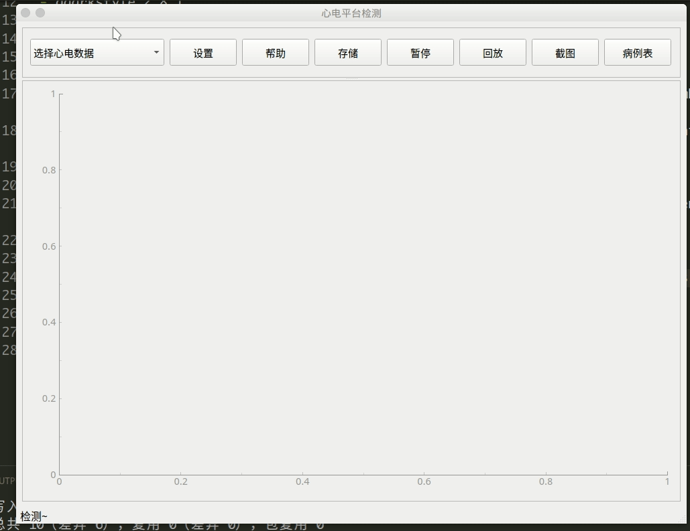

# ECG detection platform design

## Data Source

https://www.physionet.org/content/mitdb/1.0.0/

## Dependences

- mfdb 2.2.1
- PyQt5 5.14.2
- pyqtgraph 0.10.0
- qdarkstyle 2.8.1
- python 3.8.2

## Function

- [x] Display the patient's electrocardiogram dynamically, triggered when the ComboBox changes the index which the index is the unique number of patient.
- [x] The theme color and line width can be modified in the settings interface which Click the set button will open.
- [x] Click the help button will open help documention.
- [x] Click the pause button will pause electrocardiogram play.
- [x] Click the save button to store the current electrocardiogram as picture when the electrocardiogram is pausing.
- [x] Click playback button will replay electrocardiogram.
- [x] Click save data button will save patient data.
- [x] Click the patient_table_data will make a table which containing all patient cases (Include age, gender, medication, etc).

## Result

# Intro

1. `draft` folder: only test code, not contained in main progarm.
2. `python mainwindow.py` will run.